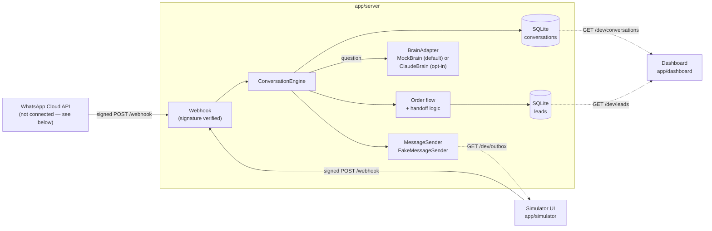

# WhatsApp AI Agent

<!--
CI badge placeholder: replace OWNER/REPO below with this repo's actual
GitHub path after the first push (the workflow won't have any runs to
report on until then, so the badge shows "no status" until it does).
-->
[](https://github.com/OWNER/REPO/actions/workflows/ci.yml)

A WhatsApp customer-support agent for a small business — answers
questions, collects orders as leads, and hands off to a human when
it's unsure — built and run entirely on a laptop, no real WhatsApp
account or cloud deployment required.

<!--
Demo GIF placeholder: record a short screen capture of the simulator
(app/simulator, http://127.0.0.1:4000) and the dashboard
(app/dashboard, http://127.0.0.1:5173) side by side, then replace the
line below with:

-->
> 🎬 **Demo GIF goes here** — a short capture of the chat simulator and
> live dashboard side by side.

## Features

- **Multilingual Q&A** — answers about hours, products/prices, and
  address, auto-detected in Hebrew, Arabic, or English, answering in
  the same language it was asked in.
- **Order flow → lead capture** — a short two-step conversation (name,
  then item) that saves a lead behind a `CrmAdapter` interface, never
  storing the customer's raw phone number.
- **Human handoff** — a customer asking for a person, or an unclear
  question, hands the conversation off and stops automated replies.
- **Two brains, one interface** — `MockBrain` (keyword-based, no
  network, the default) or `ClaudeBrain` (real Claude replies via
  `@anthropic-ai/sdk`), swappable behind one `BrainAdapter` interface.
  `ClaudeBrain` is off unless explicitly turned on — see
  [What is real and what is not](#what-is-real-and-what-is-not) below.
- **Local WhatsApp simulator** — a browser chat UI that signs and
  sends messages exactly like the real WhatsApp Cloud API would,
  without a real WhatsApp Business account.
- **Live dashboard** — conversation counts, per-conversation message
  threads with a "Handed to human" badge, and a leads table, refreshed
  every 3 seconds.
- **Infrastructure as code for two clouds** — equivalent AWS and Azure
  Terraform (API Gateway/Lambda/DynamoDB vs. Functions/Cosmos DB),
  written and validated, scanned with checkov — but never applied.
- **CI pipeline** — tests, `npm audit`, Terraform validation, checkov,
  and a secrets scan, all defined and ready to run.

## Architecture



Full write-up, including why each piece is built the way it is:
[docs/architecture.md](docs/architecture.md).

## Quick start

Needs Node.js 20+. Three terminals, all from the repo root.

1. Copy `.env.example` to `.env` and fill in `WHATSAPP_APP_SECRET` and
   `WHATSAPP_VERIFY_TOKEN` with any local placeholder values. Set
   `DEV_SIMULATOR=true` so the simulator and dashboard can read the
   agent's replies.

2. **Terminal 1 — the webhook server:**
   ```bash
   cd app/server
   npm install
   npm start
   ```
   Listens on `http://localhost:3000` (see `PORT` in `.env`).

3. **Terminal 2 — the chat simulator:**
   ```bash
   cd app/simulator
   npm install
   npm start
   ```
   Open `http://127.0.0.1:4000` and chat with the agent. The
   simulator signs each message server-side and posts it to the
   webhook — the browser never sees `WHATSAPP_APP_SECRET`.

4. **Terminal 3 — the dashboard:**
   ```bash
   cd app/dashboard
   npm install
   npm run dev
   ```
   Open `http://127.0.0.1:5173` to see conversation counts, message
   threads, and captured leads, refreshed every 3 seconds.

To try the real Claude brain instead of the mock, set `BRAIN=claude`
and `ANTHROPIC_API_KEY=<your key>` in `.env` before starting the
server (details: [docs/security.md](docs/security.md)).

## Running tests

Each app has its own suite:

```bash
cd app/server && npm test
cd app/simulator && npm test
cd app/dashboard && npm test
```

`infra/aws` and `infra/azure` are validated, not tested with a
runner — see [infra/aws/README.md](infra/aws/README.md) and
[infra/azure/README.md](infra/azure/README.md) for `terraform fmt` /
`validate` / `checkov` commands. `.github/workflows/ci.yml` runs all
of the above (plus `npm audit` and a `gitleaks` secrets scan) on every
push and pull request.

## Security highlights

- Every webhook call is verified against `X-Hub-Signature-256`
  (HMAC-SHA256 over the *raw* body, timing-safe compared) before
  anything is processed.
- Phone numbers are never stored — only a SHA-256 hash, everywhere
  (conversations, leads).
- The simulator signs and sends messages server-side; the app secret
  never reaches the browser.
- Dev-only endpoints (`/dev/outbox`, `/dev/leads`, `/dev/conversations`)
  only exist when `DEV_SIMULATOR=true`, and reject any request that
  isn't from localhost.
- `ClaudeBrain` treats customer messages as untrusted input: they're
  only ever sent as user-message content, never merged into the
  system prompt, with an explicit instruction not to follow
  instructions embedded in them or reveal the system prompt. Its
  output is parsed and validated — anything malformed, or any API
  error, falls back to a handoff reply instead of crashing or leaking
  error details. Cost is capped by `max_tokens`, a 10-message history
  limit, a per-request timeout, and a hard daily call cap
  (`AI_DAILY_CAP`).
- No secrets are ever committed — `.env` is git-ignored, `.env.example`
  only holds placeholders, and CI includes a `gitleaks` scan.

Full details: [docs/security.md](docs/security.md).

## What is real and what is not

This is a portfolio project, built to be run and read, not deployed.
Being upfront about exactly what that means:

- **Runs locally only.** Every part of this — the webhook, the
  simulator, the dashboard — runs on your own machine. Nothing is
  hosted anywhere.
- **The AI brain is a mock by default.** `MockBrain` answers with
  keyword matching, not a language model, and makes zero network
  calls. `ClaudeBrain` is real (genuine `@anthropic-ai/sdk` calls to
  Claude) but stays off unless you explicitly set `BRAIN=claude` and
  supply your own `ANTHROPIC_API_KEY`.
- **Storage is local SQLite**, not a hosted database. The Terraform
  under `infra/` provisions DynamoDB/Cosmos DB tables, but no code in
  this repo talks to either — a real deployment would need a
  DynamoDB-/Cosmos-backed adapter behind the same interfaces
  (`ConversationStore`, `CrmAdapter`) the app already uses, which
  doesn't exist yet (see [docs/decisions.md](docs/decisions.md)).
- **There is no real WhatsApp connection.** `app/simulator` mimics the
  shape of a real WhatsApp Cloud API webhook call closely enough that
  the same `app/server` code would work with a real WhatsApp Business
  account, but no such account is configured or used anywhere here.
- **`infra/aws` and `infra/azure` are written and validated, never
  applied.** `terraform fmt`, `terraform init -backend=false`, and
  `terraform validate` all pass, and both are scanned with checkov —
  but `terraform apply`/`plan` has never been run, and no cloud
  credentials exist anywhere in this repo or its CI.

## Roadmap

Rough order, not commitments:

- [ ] A DynamoDB/Cosmos DB store adapter, so `infra/`'s Terraform has
      something real to back
- [ ] A real `MessageSender` for the actual WhatsApp Cloud API
      (currently `FakeMessageSender` only stores in memory)
- [ ] Authentication on the dashboard (currently assumes only the
      developer can reach `127.0.0.1:5173`)
- [ ] More conversation flows beyond the single order flow (e.g.
      rescheduling, cancellations)
- [ ] An eval set for `ClaudeBrain`'s replies, to catch regressions
      when the prompt or model changes

## License

[MIT](LICENSE)

## Docs

See [docs/README.md](docs/README.md) for the full documentation index.
